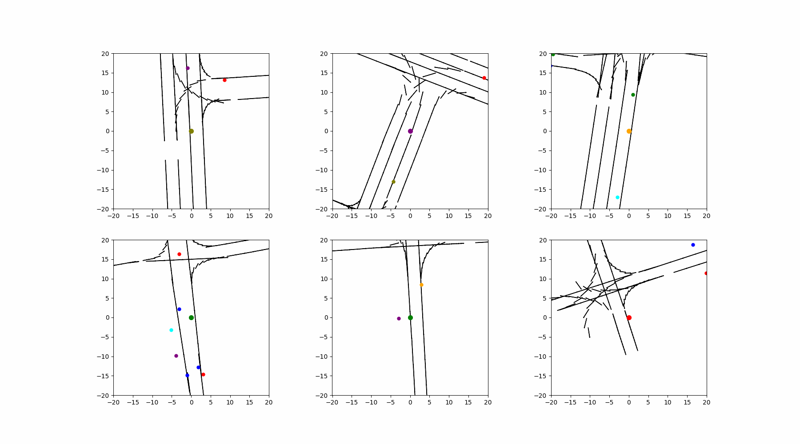

# **Spatiotemporal Trajectory Prediction for Traffic Agents**

## **About**

This project implements several machine learning algorithms relative to traffic agent trajectory prediction.

The most recent model implemented is a Seq2Seq model with a PointNet model used to encode the environment. Though simple, it gives competitive results on the ArgoVerse dataset. 

## Task List

#### Data Engineering:
- [x] Agent-Centered Transformations
- [x] Orientation from start/end of input sequence
- [ ] Orientation from displacements
- [x] Lane Relevancy Metrics (Rear, Orientation Alignment, Distance, etc.)

#### Backbones:
- [x] MLP
- [x] RNN
- [x] Seq2Seq (LSTM, GRU, etc.)
- [ ] Transformer
- [ ] Graph Neural Network

#### Spatial Encodings:
- [x] Sinusoidal Positional Embeddings (MLP)
- [x] PointNet
- [ ] PointNet++
- [ ] Graph Convolutional Network
- [x] ResNet
- [x] CNN
- [x] ConvLSTM

#### Loss Functions:
- [x] ADE/FDE Loss

#### Other Approaches:
- [ ] Social Pooling
- [ ] SocialGAN
- [ ] STGAT
- [ ] Trajectron
- [ ] TPNet

## Contact
Yishai Silver (ssilver@ucsd.edu)