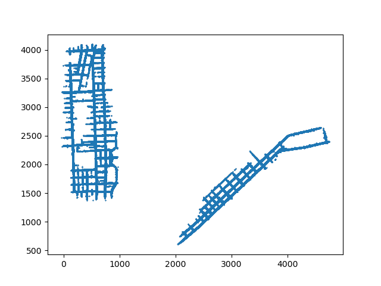
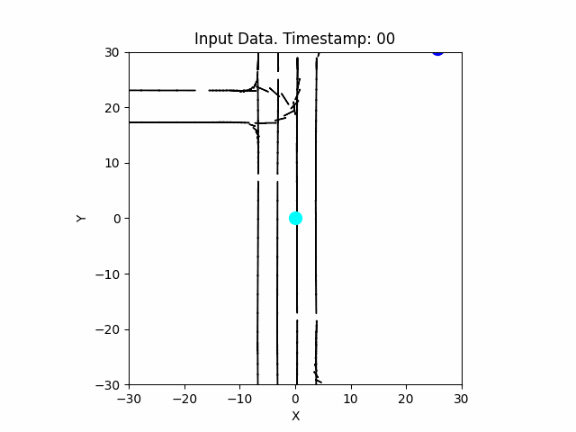

# Spatiotemporal Trajectory Prediction for Traffic Agents

### Can we infer the future positions of traffic agents?

- [Introduction](#introduction)
- [Exploring The Dataset: Argoverse](#exploring-the-dataset-argoverse)
    - [Explore a Scene](#explore-a-scene)
    - [Transforming the POV](#transforming-the-pov)
        - [Position](#position)
        - [Orientation](#orientation)
    <!-- - [Lane Relevancy](#lane-relevancy) -->
- [Model considerations](#model-considerations)

# Introduction

This is an interesting problem first introduced to me in an undergrad class, and, frankly, it was my first real introduction to ML (asides from training YOLO models like a script-kiddy). Despite being a top-performer in the class, my code was quite terrible, consisting mostly of some poorly documented jupyter notebooks. As such, I've decided to revisit the problem, clean it up, and see if I can take it further. Moreover, the spatio-temporal nature of the problem is applicable to many other fields (Ad ranking, NLP, robotics, etc.), so it's a good problem to have a solid understanding of.

# Exploring the Dataset: Argoverse

The description for the dataset is gives as follows:
```
    city- a string for the city the data was taken from. Can either be 'PIT' or 'MIA'
    scene_idx- a unique non-zero integer identifying the scene
    track_id- tracked maximum 60 agents with 32 digits ID in the form of "00000000-0000-0000-0000-0000XXXXXXXX"
    agent_id- The track id for the agent to be predicted in this scene
    p_in- the (x,y) position input in the first two seconds (19 time steps) of max 60 tracked agents
    v_in-the (x,y) velocity input in the first two seconds (19 time steps) of max 60 tracked agents
    p_out- the (x,y) position output in the next three seconds (30 time steps) of max 60 tracked agents
    v_out - the (x,y) velocity output in the next three seconds (30 time steps) of max 60 tracked agents
    car_mask- boolean index for the real car, we need to align the car numbers. We track maximum 60 agents. Mask equals 1 means the agent appears in the scene, and 0 otherwise
    lane- a (k, 2) numpy array of floats where 'k' is the number of lanes in the scene, representing (x,y) position for centerline nodes in this scene
    lane_norm- a (k, 2) numpy array of floats where 'k' is the number of lanes in the scene, representing the direction of each lane node
```

## Explore a Scene
For starters, let's create an animation consisting of the most basic information being provided: 
- Lanes (constructed from their positions and norms) 
- Agent positions and velocities (represented as points and arrows, respectively).


At this level, certain details emerge: 
- What the heck is our coordinate frame? Why are our points plotted between such weird ranges
- We can clearly make out an intersection. 
- There is some interesting behaviors apparent in this one scene:
    - The red agent waits for the olive agent to pass before performing a right-turn onto the main road.
    - The olive agent changes lanes to overcome towards the left right as the input data stops and the output data begins.
- The velocities are rather noisy; if we look at the bottom three agents, their velocity go all over the place despite them staying relatively still. If we are going to use velocity at all, we may need to filter it in some way.

Let's try to discover the coordinate frame by plotting all of the values of p_in on a single plot:



We get two cities, which must be why there is the `city` field for each scene. More importantly, if we were to naively use these positions as inputs, the equivalent would be:
- *Driving with a GPS zoomed all the way out* 
- *Driving while oriented towards north* 

Maybe someone could do these things, but it's not practical, we don't do that,  and it doesn't make sense for us to impose these limitations on our network. Instead, let's put the world relative to us.

## Transforming the POV

### Position
This is done easily by subtracting the ego agent's position from all of the other agents' positions.

### Orientation

This is a bit more tricky as the orientation of the agents is not given. Instead, we need to infer it.

First Notes:
- Due to the erratic velocity we saw earlier, we aren't going to rely on it for orientation, even though conceptually that's an extremely strong option. 
- Even the positions are somewhat noisy, so without filtering, we might get a noisy orientation.
- We can use the closest lane, but this may fail in the case of intersections (If you look at the olive agent, we can see that his orientation would be quite erratic, especially due to his lane change).
- Perhaps we can use something like a kalman filter? Maybe a submodel that predicts the orientation based on the positions of the agents?

To begin with, we'll use the angle between the first and last input positions. This approach will give stable results and is reasonable enough. It'll also make the network's job easier by providing a stable orientation (we only have to worry about the positional change of the ego agent). It also makes it easier to update lanes, since we only have to rotate them once.

### Results



The data is now much more intuitive. Asides from the static angle, we can see that this is not too different from how we might percieve the world while driving. Moreover, the input data is now more or less aligned in a single direction, which should make it easier for the network to learn; none of us  drive sideways, so why should we impose that on our network?

One major note is that we need to transition from predicting positions to predicting displacements. As shown in the animation, the ego agent is always at the origin, so p_in becomes nothing but 0s. We can't infer anything from that, so we need to predict the change in position (which will still give us our movement in the world).

# Model considerations


There's a couple challenges that we need to address:
- Variable inputs:
    - The number of agents in the scene can vary.
    - The number of lane positions can vary.
    - 
- Spatial considerations

Possible solutions (certainly not extensive, but we'll add as we go):
- Variable input length:
    - Zero-Padding
    - RNNs
    - Recursion
- Spatial considerations:
    - CNNs
    - Positional Embeddings (I.e. NeRF stuff)
    - Attention
    - Graph Neural Networks

### Pipeline Philosophy

There's a bunch of models that we can use, each with a varying amount of input. Each model may need to have its inputs transformed/organized in a different way. As an example, a CNN may need images, an RNN may need sequences, and an MLP may need a flattened vector. Once we add in the different ways these formats need to be assembled depending on what information is being included, the requirements become quite complex.

In order to keep things simple and organized, as well as to make it easier to swap models, we'll add a special kind of transformation layer that will take in the raw data and encapsulate model's needs as a tuple of matrices. The model will then be able to take in this tuple and do its thing, knowing that the data is in the correct format.

As such, the pipeline will look something like this:

Dataset -> Transformation -> Per-Model Preprocessing -> Collation -> Model Inference -> Data Postprocessing -> Loss -> Backpropagation

### MLP

To start, let's validate our pipeline with a simple MLP. Moreover, we'll do a simple ablation study to validate our prior conclusions.

<details><summary>Ablation Study</summary>

| Ablation Study with MLP                                                                                      |
|--------------------------------------------------------------------------------------------------------------|
| MLP on just the (naive) positions of the ego agent                                                         |
| MLP with the world transformed w.r.t the ego agent                                                          |
| MLP with the world transformed w.r.t the ego agent, but with the lanes (and their normals)                 |
| MLP with the world transformed w.r.t the ego agent, but with the n closest agents (0 padding where needed) |
| MLP with the world transformed w.r.t the ego agent, but with the n closest agents and the lanes            |
| MLP with the world transformed w.r.t the ego agent and the lanes, but with the lanes filtered by their normal |
| MLP with the world transformed w.r.t the ego agent and the filtered lanes and the n closest agents         |

</details>

Put simply, we can see that transformation makes a big impact. 


### Lane Relevancy

Now that we're including lanes, we should ask ourselves: "How relevant are lanes to the task at hand?"

At first glance, the answer is "very," but, looking at the animation centered on the ego agent, we can see that not all lanes are created equal. In fact, the intersection is somewhat confusing in terms of which direction agents should be heading. As such, we'll perform an experiment where we filter out lanes positions where the normal is not sufficiently aligned with the ego agent's orientation.

## Research
- This is not a new problem, 
