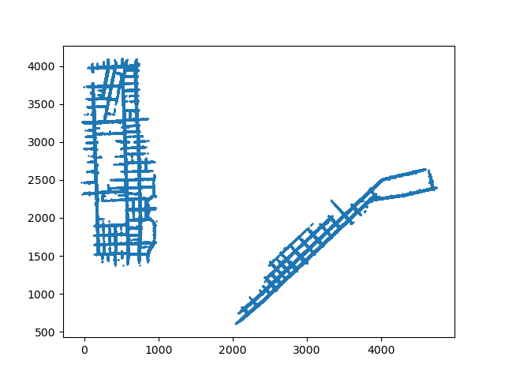

# In the beginning there was bad data.

### Animate a scene
For starters, let's create an animation consisting of the most basic information being provided: 
- Lanes (constructed from their positions and norms) 
- Agent positions and velocities (represented as points and arrows, respectively).

At this level, certain details emerge: 
- What the heck is our coordinate frame? Why are our points plotted between such weird ranges
- We can clearly make out an intersection. 
- There is some interesting behaviors apparent in this one scene:
    - The red agent waits for the olive agent to pass before performing a right-turn onto the main road.
    - The olive agent changes lanes to overcome towards the left right as the input data stops and the output data begins.
- The velocities are rather noisy; if we look at the bottom three agents, their velocity go all over the place despite them staying relatively still. If we are going to use velocity at all, we may need to filter it in some way.
- Some intents aren't apparent from the data. For example, the red agent could just as well have turned left instead of right, but we have no way of knowing that from the input data alone. I.e. we cheat by using the output data to determine the intent of the agent, but this will not be available at the time of inference.

Let's try to discover the coordinate frame by plotting all of the values of p_in on a single plot:

We get two cities, which must be why there is the `city` field for each scene. More importantly, if we were to naively use these positions as inputs, the equivalent would be:
- *Driving with a GPS zoomed all the way out* 
- *Driving while oriented towards north* 

Maybe someone could do these things, but it's not practical and it doesn't make sense for us to impose these limitations on our network. Instead, let's put the world relative to us.

## Let's

Let's first examine the data as a whole. We can start with plotting all of the input positions (the positions being fed into our model) as a whole to see what sort of distribution we get:

